# FTP 服务器架构图

## 一、业务逻辑图

### 1.1 系统整体架构

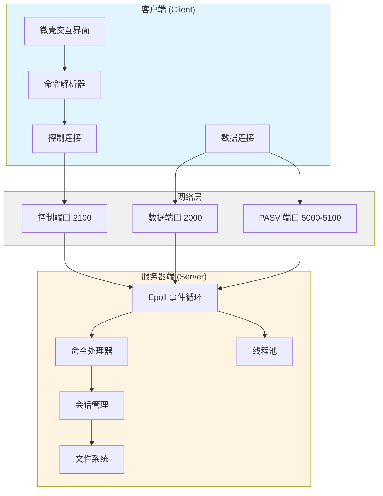

### 1.2 核心业务流程

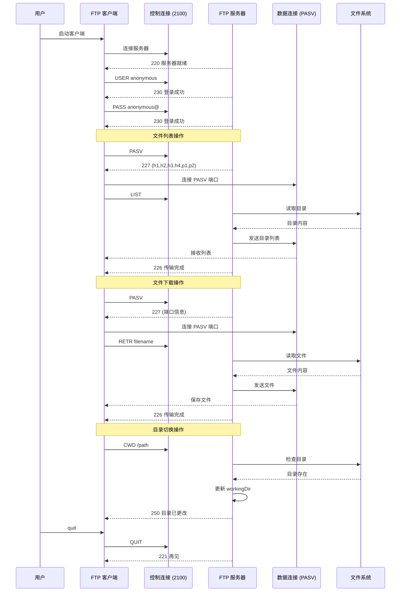

### 1.3 会话管理流程

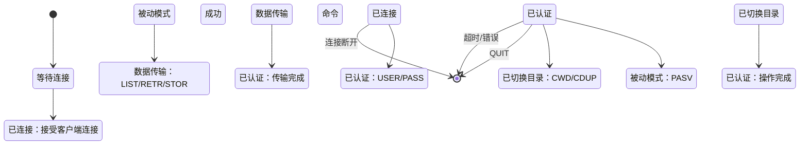

### 1.4 被动模式 (PASV) 工作流程

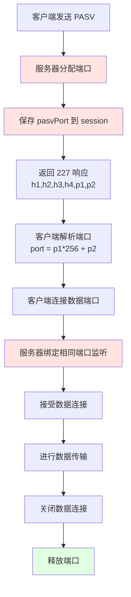

---

## 二、代码流程图

### 2.1 服务器启动流程

```mermaid
flowchart TD
    Start([main 函数]) --> CreateServer[创建 Server 对象<br/>controlPort=2100<br/>dataPort=2000]
    CreateServer --> CallStart[调用 server.start()]
    
    CallStart --> CreateControlSock[创建控制套接字]
    CreateControlSock --> BindControl[绑定控制端口 2100]
    BindControl --> ListenControl[监听控制端口]
    
    ListenControl --> CreateDataSock[创建数据套接字]
    CreateDataSock --> BindData[绑定数据端口 2000]
    BindData --> ListenData[监听数据端口]
    
    ListenData --> CreateEpoll[创建 epoll 实例]
    CreateEpoll --> AddControlToEpoll[添加控制套接字到 epoll]
    AddControlToEpoll --> PrintInfo[打印服务器信息]
    PrintInfo --> ReturnTrue[返回 true]
    
    ReturnTrue --> CallRun[调用 server.run()]
    CallRun --> EpollWait[epoll_wait 循环]
    
    style CreateServer fill:#e1f5ff
    style CallStart fill:#e1f5ff
    style CallRun fill:#e1f5ff
    style EpollWait fill:#fff4e1
```

### 2.2 Epoll 事件处理流程

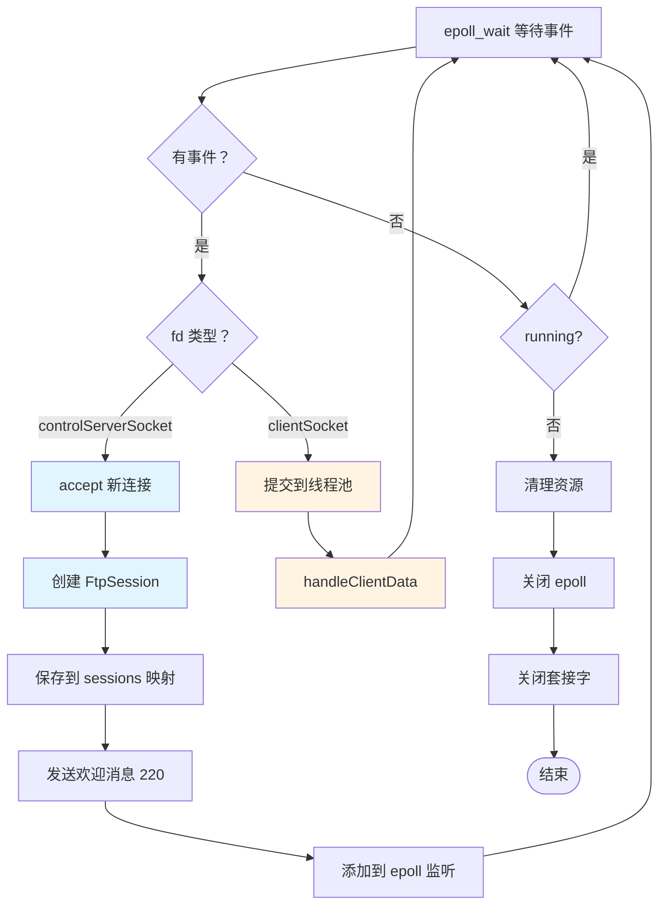

### 2.3 命令处理流程

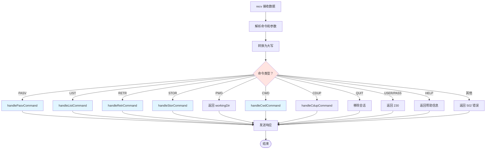

### 2.4 LIST 命令详细流程

```mermaid
sequenceDiagram
    participant C as 客户端
    participant S as 服务器
    participant Session as Session 对象
    participant FS as 文件系统
    
    C->>S: PASV
    S->>Session: 保存 pasvPort
    S-->>C: 227 (10,30,0,158,19,143)
    
    C->>S: 连接到 PASV 端口 5007
    
    C->>S: LIST
    S->>Session: 读取 pasvPort
    S->>S: 创建监听套接字<br/>绑定 pasvPort
    S->>S: accept 数据连接
    S-->>C: 150 准备发送目录列表
    
    S->>FS: opendir + readdir
    FS-->>S: 目录条目
    
    S->>S: 格式化目录列表
    S->>数据连接：发送目录内容
    S->>S: 关闭数据连接
    
    S-->>C: 226 传输完成
    
    Note over S: 关键修复：使用 session<br/>保存的 pasvPort，<br/>而不是重新分配
```

### 2.5 CWD 命令详细流程

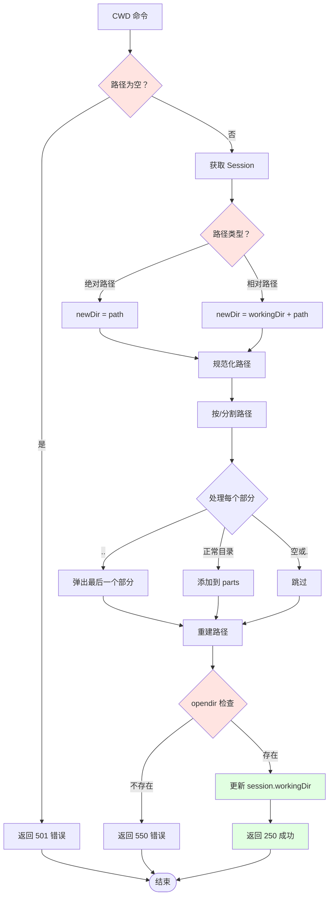

### 2.6 文件下载 (RETR) 流程

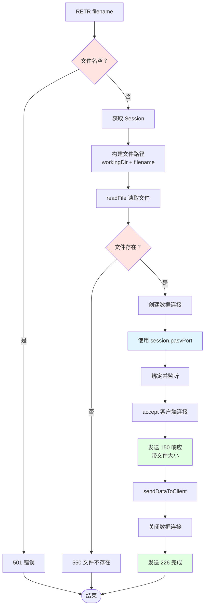

### 2.7 客户端交互流程

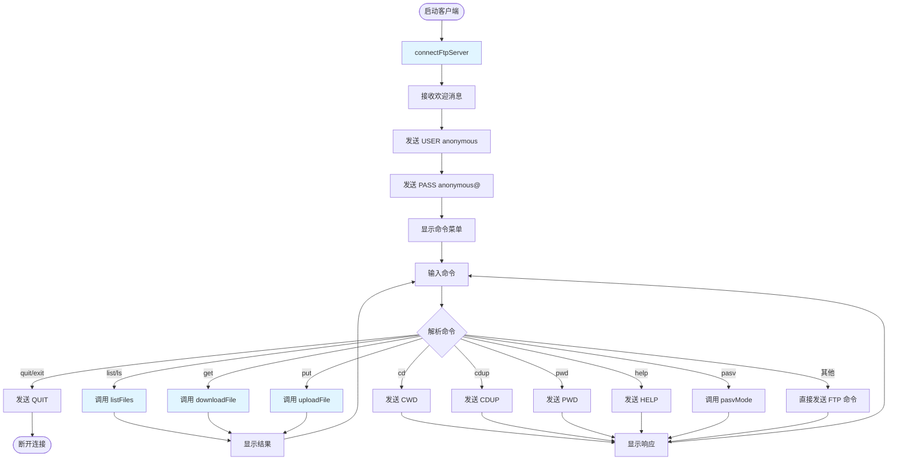

---

## 三、数据结构图

### 3.1 FtpSession 结构

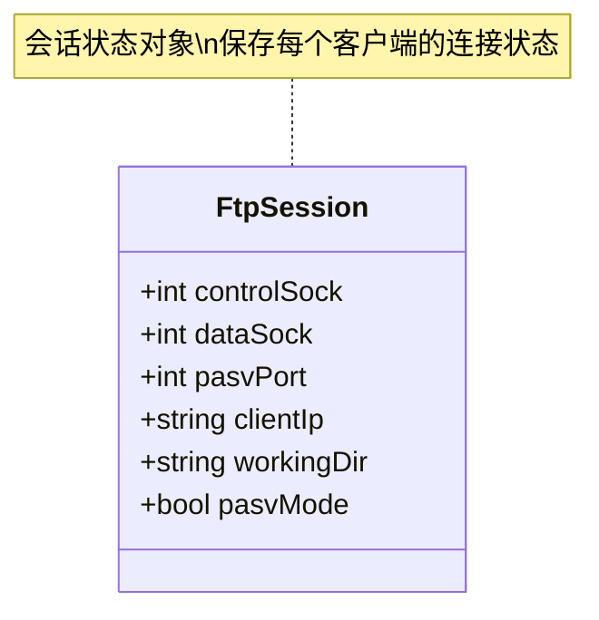

### 3.2 Server 类结构

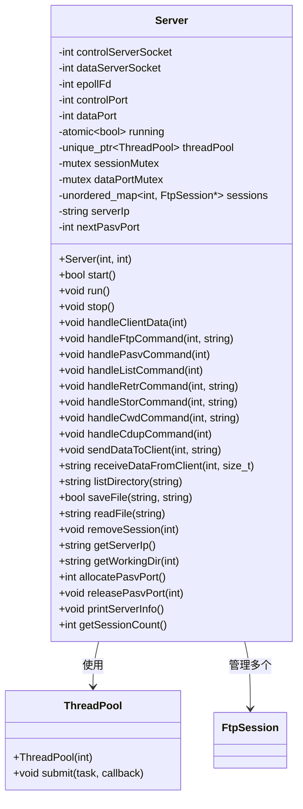

### 3.3 Client 类结构

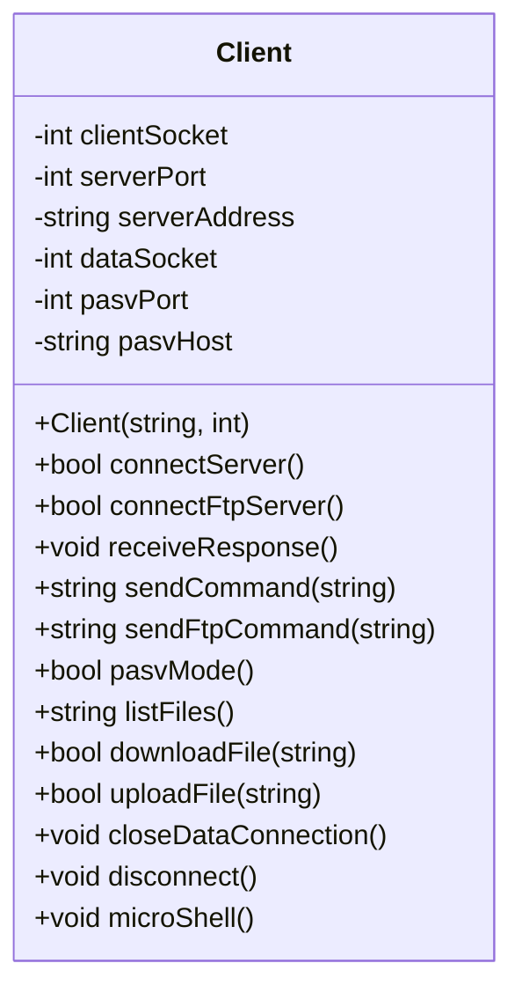

---

## 四、端口使用图

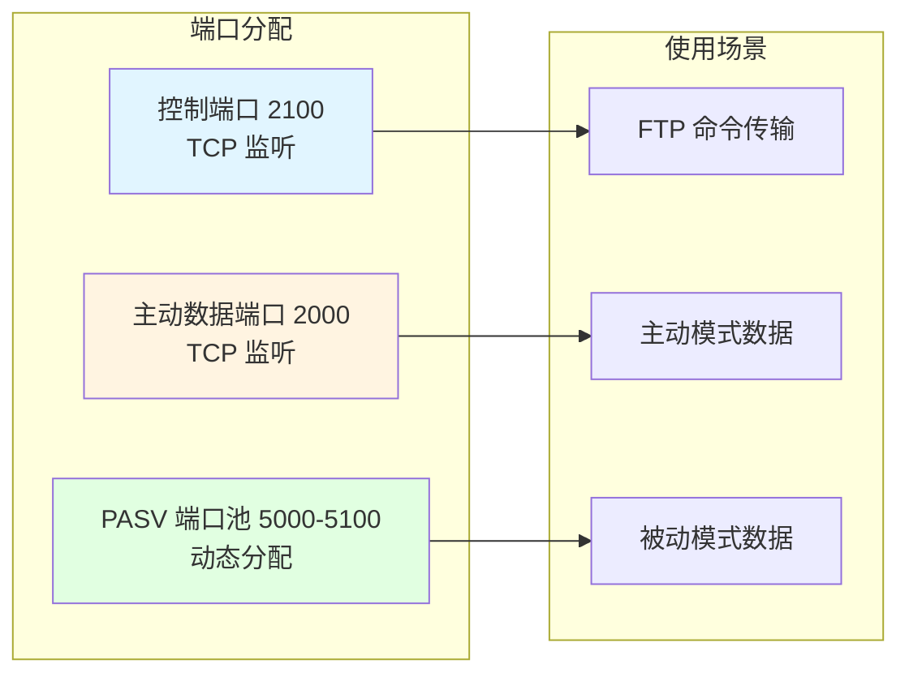

---

## 五、关键修复对比

### 5.1 LIST 命令修复前后对比

```mermaid
flowchart TD
    subgraph Before["修复前 ❌"]
        B1[客户端 PASV] --> B2[服务器分配端口 5001]
        B2 --> B3[客户端 LIST]
        B3 --> B4[服务器重新分配 5002]
        B4 --> B5[客户端连接 5001]
        B5 --> B6[服务器监听 5002]
        B6 --> B7[连接失败！]
    end
    
    subgraph After["修复后 ✅"]
        A1[客户端 PASV] --> A2[服务器分配 5001<br/>保存到 session]
        A2 --> A3[客户端 LIST]
        A3 --> A4[服务器使用 session.pasvPort 5001]
        A4 --> A5[客户端连接 5001]
        A5 --> A6[服务器监听 5001]
        A6 --> A7[连接成功！]
    end
    
    style B7 fill:#ffe4e1
    style A7 fill:#e1ffe1
```

### 5.2 CWD 命令修复前后对比

```mermaid
flowchart TD
    subgraph Before["修复前 ❌"]
        B1[客户端 CWD /bin] --> B2[服务器返回<br/>"目录已更改"]
        B2 --> B3[workingDir 未更新]
        B3 --> B4[后续操作仍在根目录]
    end
    
    subgraph After["修复后 ✅"]
        A1[客户端 CWD /bin] --> A2[解析路径]
        A2 --> A3[规范化路径]
        A3 --> A4[opendir 检查]
        A4 --> A5[更新 workingDir]
        A5 --> A6[返回 250 成功]
        A6 --> A7[后续操作在/bin 目录]
    end
    
    style B4 fill:#ffe4e1
    style A7 fill:#e1ffe1
```

---

## 六、响应码对照表

| 响应码 | 含义 | 使用场景 |
|--------|------|----------|
| 150 | 准备发送/接收 | LIST/RETR/STOR 开始前 |
| 200 | 命令成功 | TYPE 命令 |
| 211 | 系统状态 | FEAT 命令 |
| 214 | 帮助信息 | HELP 命令 |
| 215 | 系统类型 | SYST 命令 |
| 220 | 服务就绪 | 连接建立时 |
| 221 | 服务关闭 | QUIT 响应 |
| 226 | 传输完成 | LIST/RETR/STOR 完成 |
| 227 | 进入被动模式 | PASV 响应 |
| 230 | 登录成功 | USER/PASS 响应 |
| 250 | 请求操作成功 | CWD/CDUP 响应 |
| 257 | 路径名创建 | PWD 响应 |
| 421 | 服务不可用 | 服务器关闭 |
| 425 | 无法打开数据连接 | 数据连接失败 |
| 500 | 语法错误 | 空命令 |
| 501 | 参数错误 | 缺少参数 |
| 502 | 命令未实现 | 未知命令 |
| 550 | 文件/目录不可用 | 文件不存在 |
